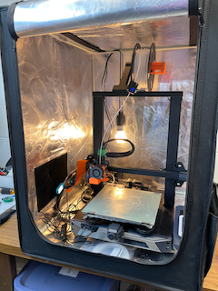

# ender-3-s1-kilpper
<h1>Config files for 3D printing on a Creality Ender 3 S1 running Klipper firmware</h1>

I bought Creality's Ender 3 S1 in mid 2022 and have been mostly happy with it.  Sample prints out of the box were great, but it didn't take long to mod mine for "exotic" materials before the S1 Pro was released.  I mostly print functional items and the occasional "fun" things for family and friends.  Think: replacement washing machine rack wheels, motorcycle wind deflectors and GPS mounts, tools and organizers, personalized gifts and awards for work and charities and so on.

When Miguel started making a Marlin-based "Professional Firmware" (https://github.com/mriscoc/Ender3V2S1), I was really happy to enjoy control over more parameters, and indeed his work is super helpful and worthy of support.  That said, by early 2024 it was hard to ignore big differences between my S1 and the latest generation of printers such as Bamboo Labs' A1, P1S and X1C, as well as Creality's K1 series, Vorons and other CoreXY printers - all of which are faster using advanced hardware for greater quality with less fuss.  Still, they're not free, so I wanted to experiment with even more sophisticated firmware to stave off getting a new unit.  Enter Klipper, which is the foundation of most of the latest generation units (as of 2024 anyway) and is overtaking Marlin.

So, once you've decided on Klipper for the S1, the fastest solution is to buy Creality's Sonic Pad for $150 and let it do the hard work, but I already had a Raspberry Pi 3 and 7" touch screen with a stand.  I'm still not able to get the touch screen to work reliably with KlipperScreen, but I have managed to switch to Klipper, Mainsail, MobileRaker and a bunch of mix-ins that are working really well for me.  I'll continue to dial these in over time but one of the benefits to a custom setup is getting to know your printer, Klipper, and 3D printing much more intimately.  Sure, that's not as deep as building your own Voron from scratch, but you get the point.

Are you in a similar boat, er, Benchy?

In this repository are my core Klipper files to compare, contrast, leverage or critique what I'm using.  These may work well for you as-is, or may be a little off for your situation, so it's on your shoulders to use a critical eye and take your time.  I'm doing this mainly to back myself up with version control in case I make a stupid mistake with tuning and have to roll back settings, but it would be great if others are helped as well.

<b>For reference, my S1 is fairly-well modded:</b>
- Replaced power supply with a stronger unit since stock couldn't keep up with higher toolhead and bed temps needed for nylon, polycarbonate, ABS, etc.
- Replaced heatbrake with all metal one from Slice Engineering for higher temps (stock HB has PTFE)
- Replaced hotend with K1's ceramic unit (stock can't get to 300C) and a 0.4 mm brass nozzle to handle higher flow rates using non-abrasive filaments
- Set up a second Spring Pro extruder assembly with a 0.6 mm hardened steel nozzle for the (CF) abrasive filaments
- Replaced cooling with 3D-printed PETG manifold and stronger fan (helps with higher speeds to reduce stringing and improve bridging)
- Added squash balls as feet to help absorb motion ringing and reduce printing noise
- Replaced spool holder with 3D-printed ball bearing unit - this helps a lot with heavy spools, especially TPU, which can skip in the extruder if it has to pull very hard
- Replaced bed material with garolite (aka G10) and glue stick - I really, really like this for everything, and use little binder clips to hold the plate on the bed
- Added toolhead cable support to reduce twisting stress at the head's base
- Added reflectix insulation under the bed for more efficient heating
- Added a soft enclosure from Amazon and put a rigged a fan with filter on the side to deal with filament fumes

<b>Current Status as of 2/14/2024:</b>
- Overall, Klipper and Mainsail are working great on my Raspberry Pi 3B - I'm happy with roughly double the stock speeds using PLA, PETG, ABS, ASA, PA and PC without loss of quality or layer adhesion as long as I stay under 150 mm/s with PLA and under 75-100 mm/s with advanced filaments.  I haven't increased TPU speeds because layer adhesion is even more important with flexible materials for functional prints like camping chair feet and protective hardware covers
- The PID tunes of my hotend and bed are working well
- The tuned pressure advance value is working well
- The hardware retraction values seems pretty good in combination with pressure advance.  I did both of these calibrations back-to-back a couple times
- I acquired a KUSBA accelerometer and calibrated input shaping, eliminating almost every shadow of a ghost
- Jschuh's extended Klipper macros are great especially for improved bed leveling - see https://github.com/jschuh/klipper-macros.  Note that it's really important to modify your slicer's Machine settings to use his scripts, which is why I have a section of files in the Prusa_Slicer folder
- My C615 Camera via Crowsnest is working well but could use more tuning
- Raspberry Pi's 7" touchscreen uses I2C to send finger presses, so you have to use "sudo raspi-config" to enable I2C, but I'm struggling to get mine to display reliably. I've given up on that for now and just use a computer nearby to control my prints
- Note that my klipper.bin works on my early S1 with a F103 chip.  Do NOT try on a F4 processor!

Anyway, if you found this page and these are helpful to you, great!  I don't want a coffee, don't smash that Like button, and don't you dare subscribe! :-).  Please channel any donations to others materially evolving the 3D printing hobby - I think we're all indebted to them enough already!